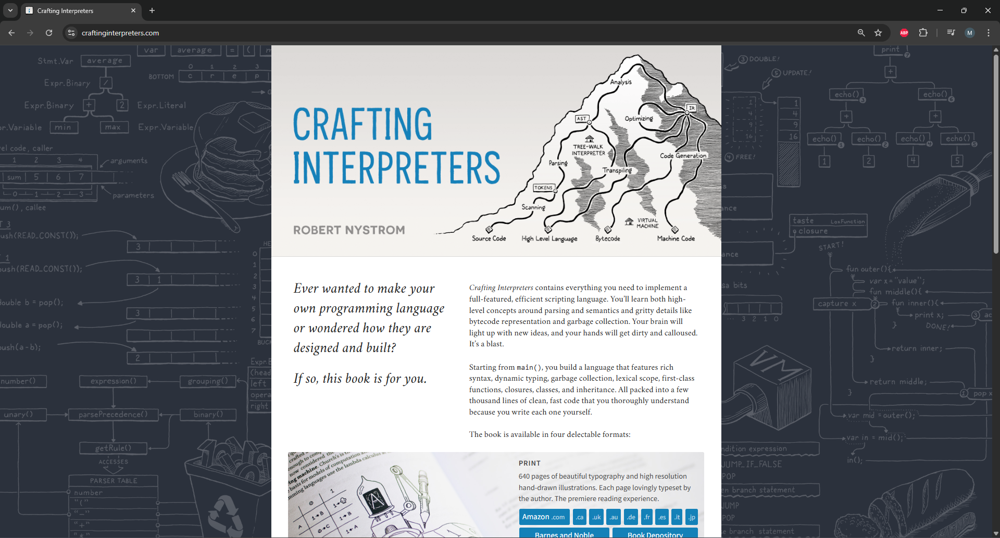

#Lox Translator - Crafting Interpreters  

The following project is based of a book called Crafting Interpreters : https://craftinginterpreters.com/.
The book breaks down a coding language into parts and building blocks, and creates its own language, Lox (Java Based).
The book goes into extreme detail from the basic data tokens, arranging them into readable form, and running their corresponding functions.  

## The Project and its Purpose

This project was one of the highlights of my education in the fundamentals of coding. I was given the task to follow the book and create a Lox interpreter and compile it in C++. I have also done this project as well in Visual Basic.
The purpose of this project is to showcase my skills and understand code, its formation, and functionality. Each language has its own standards, syntax, style, and logic. By translating the functionality of one language to another, you may have to compensate on the difficulties of compiling in another language.

### How does it work

By running the file in Visual Studios, it will create a console prompt in which you can run basic code functions. You can create Global or local variables and do things like add, multiply, subtract. You can create functions and even classes. It is simply coding with a language that you created. You are programming Lox using C++.

## Project Conclusion and Future Plans
This project serves no public functionality. It can be done multiple times with different languages, and I plan to redo this project in C# instead. This project is good practice when it comes to understanding code and the language that you use. It is a showcase of skill because even if the book is a step by step guide in how to approach building the interpeter, by using a different language, you have to ask how the functionality of one language may work in another. Thus you have to take the idea and find a way to make it work in the language you are using. It will be different for every language. 

## Resources
Book: https://craftinginterpreters.com/  
C++ Syntax: https://www.w3schools.com/cpp/cpp_syntax.asp  
